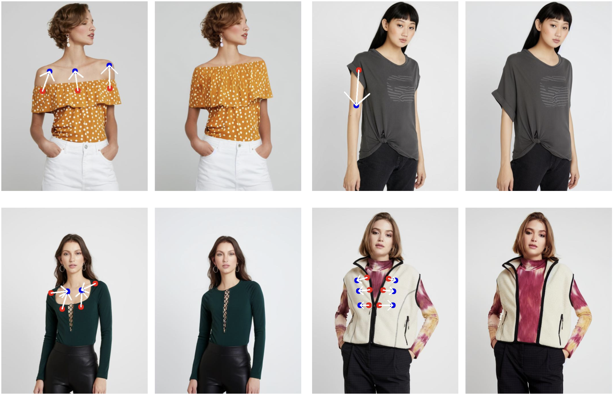
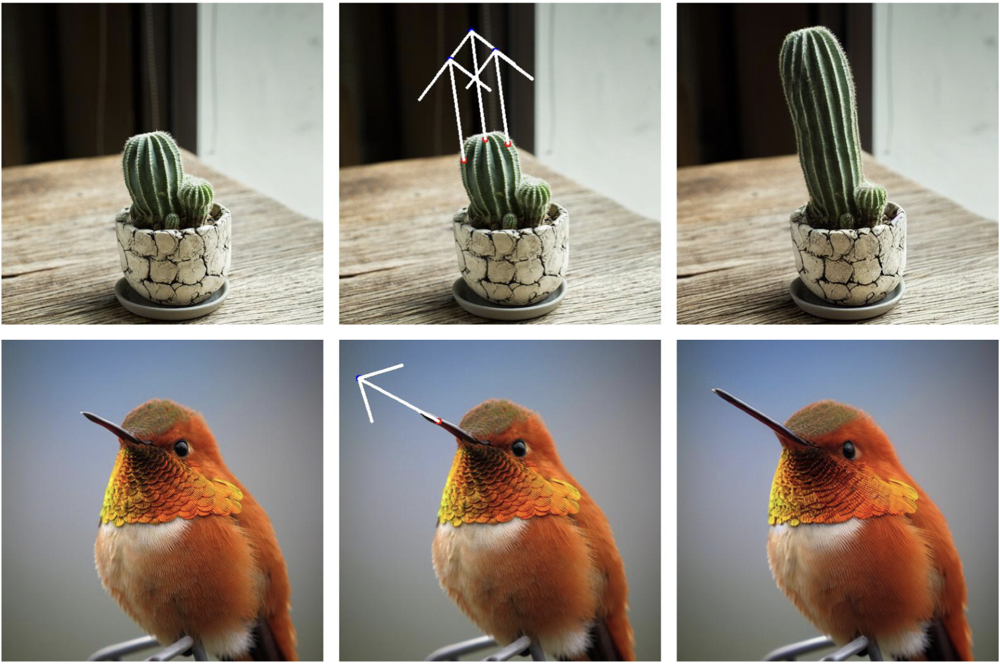

<p align="center">
  <h1 align="center">
AdaptiveDrag:Semantic-Driven Dragging on Diffusion-Based Image Editing
</h1>
  <p align="center">
    <!-- <a href="https://yujun-shi.github.io/"> -->
    <strong>DuoSheng Chen</strong></a>
    &nbsp;&nbsp;
    <strong>Binghui Chen</strong>
    &nbsp;&nbsp;
    <strong>Yifeng Geng</strong>
    &nbsp;&nbsp;
    <strong>Liefeng Bo</strong>
    &nbsp;&nbsp;
    <strong>Liefeng Bo</strong></a>
    <br>Institute for Intelligent Computing, Alibaba Group
  </p>
    <p align="center">
    <a href="https://arxiv.org/pdf/2410.12696"></a>
    <!-- <a href="https://yujun-shi.github.io/projects/dragdiffusion.html"></a> -->
    <!-- <a href="https://twitter.com/YujunPeiyangShi"></a> -->
  </p>
  <div align="center">
    
    <br>
    
  </div>
  <!-- <div align="center">
    
  </div> -->

</p>


## Installation

It is recommended to run our code on a Nvidia GPU with a linux system. 
And， it requires around 13 GB GPU memory to run our method. 

To install the required libraries, simply run the following command:
```
conda env create -f environment.yaml
conda activate adaptivedrag
```

## Run AdaptiveDrag
To start with, in command line, run the following to start the gradio user interface:
```
python3 drag_ui.py
```

Basically, the AdaptiveDrag consists of the following steps:

### Case 1: Dragging Input Real Images
#### 1) train a LoRA
* Drop our input image into the left-most box.
* Input a prompt describing the image in the "prompt" field
* Click the "Train LoRA" button to train a LoRA given the input image

#### 2) do "drag" editing
* Draw a mask in the left-most box to specify the editable areas.
* Click handle and target points in the middle box. Also, you may reset all points by clicking "Undo point".
* Click the "Run" button to run our algorithm. Edited results will be displayed in the right-most box.

### Case 2: Dragging Diffusion-Generated Images
#### 1) generate an image
* Fill in the generation parameters (e.g., positive/negative prompt, parameters under Generation Config & FreeU Parameters).
* Click "Generate Image".

#### 2) do "drag" on the generated image
* Draw a mask in the left-most box to specify the editable areas
* Click handle points and target points in the middle box.
* Click the "Run" button to run our algorithm. Edited results will be displayed in the right-most box.

## License
Code related to the AdaptiveDrag algorithm is under Apache 2.0 license.


## BibTeX
If you find our repo helpful, please consider leaving a star or cite our paper :)
```bibtex
@article{chen2024adaptivedrag,
  title={AdaptiveDrag: Semantic-Driven Dragging on Diffusion-Based Image Editing},
  author={Chen, DuoSheng and Chen, Binghui and Geng, Yifeng and Bo, Liefeng},
  journal={arXiv preprint arXiv:2410.12696},
  year={2024}
}
```


## Contact
For any questions on this project, please contact Chen, Duosheng [calvinchen11311@gmail.com](calvinchen11311@gmail.com)
<!-- (https://yujun-shi.github.io/)  -->

## Acknowledgement
This work is inspired by the amazing [DragGAN](https://vcai.mpi-inf.mpg.de/projects/DragGAN/). 

Following DragDiffusion, the lora training code is modified from an [example](https://github.com/huggingface/diffusers/blob/v0.17.1/examples/dreambooth/train_dreambooth_lora.py) of diffusers. Image samples are selected from [DragBench](https://github.com/Yujun-Shi/DragDiffusion) and [VITON-HD](https://github.com/shadow2496/VITON-HD). 

## Related Links
* [Drag Your GAN: Interactive Point-based Manipulation on the Generative Image Manifold](https://vcai.mpi-inf.mpg.de/projects/DragGAN/)
* [DragDiffusion: Harnessing Diffusion Models for Interactive Point-based Image Editing](https://github.com/Yujun-Shi/DragDiffusion/)
* [Drag Your Noise: Interactive Point-based Editing via Diffusion Semantic Propagation](https://github.com/haofengl/DragNoise/)
* [EasyDrag: Efficient Point-based Manipulation on Diffusion Models](https://github.com/Ace-Pegasus/EasyDrag/)
* [FastDrag: Manipulate Anything in One Step](https://github.com/XuanjiaZ/FastDrag)
